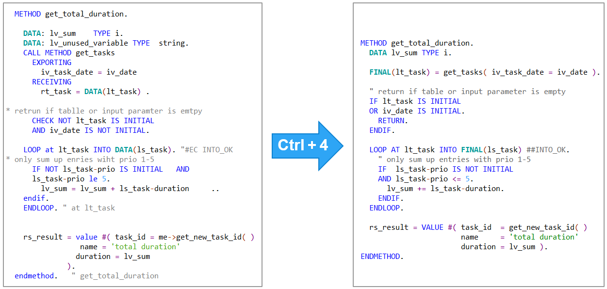
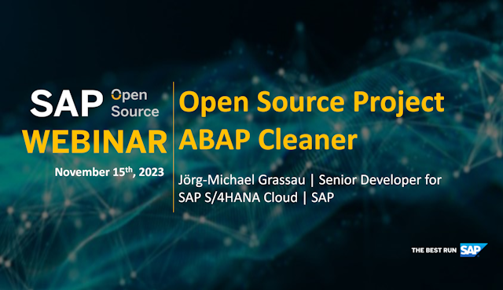
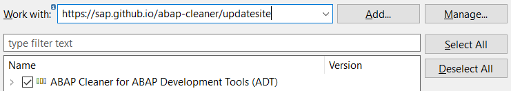

# ABAP Cleaner

|  | *ABAP cleaner* is a configurable tool with the ambition to *automate   whatever can be automated* with respect to ABAP code style. |
| --- | :--- |

## What the ABAP Cleaner Tool Offers

While there is no lack of guidelines and rules on what clean ABAP code should look like...

- the [Clean ABAP Styleguide](https://github.com/SAP/styleguides/blob/main/clean-abap/CleanABAP.md), 
- the [Clean Code Checks](https://github.com/SAP/code-pal-for-abap/blob/master/docs/check_documentation.md), 
  as implemented in the [Code Pal for ABAP](https://github.com/SAP/code-pal-for-abap/) project, 
- team-specific programming guidelines etc. 

... these guidelines leave the work of *writing* clean code (or *cleaning* existing code) entirely to you. 

The ABAP cleaner tool does a lot of this work *for you* by **automating** as many of these rules as possible, 
while giving you full control over which rules are used and how. 

With ABAP cleaner, you can clean any amount of code from a single statement to an entire code document 
with **one keystroke**. ABAP cleaner then applies **95+ different [cleanup rules](docs/rules.md)** to your code section, 
cleaning approx. 1 MB of code per second.

> Please don't get us wrong: Of course, an automated tool can NOT replace all other clean code efforts. 
> Obviously, automation is only possible for a subset of the clean code rules - but for a significant one, 
> including formatting, alignment, replacing obsolete commands, and even reducing some nesting depth. 
> This saves you tedious work, leaving you more time to focus on more complex requirements, such as 
> modularization, testability, and good naming. 

ABAP cleaner is installed with two **profiles**: 

- in the '**default**' profile, most available cleanup rules are activated with what we believe are good default settings 
  in alignment with the [Clean ABAP Styleguide](https://github.com/SAP/styleguides/blob/main/clean-abap/CleanABAP.md) 
  (and even going beyond its demands);
- in the '**essential**' profile, only those cleanup rules are active which are explicitly demanded by the 
  [Clean ABAP Styleguide](https://github.com/SAP/styleguides/blob/main/clean-abap/CleanABAP.md); 
  this applies to approx. 40% of the available cleanup rules. 

Additionally, you can create your own profiles:  In each profile, you can **select** which cleanup rules shall be active, 
and **configure** options and thresholds for these rules. 
Your team may align on a common configuration and create a **team profile** from it.

## Demo of ABAP Cleaner

<table>
  <tr>
    <th width="50%">How to install, use, and configure</th>
    <th width="50%">How ABAP cleaner has evolved</th>
  </tr>
  <tr>
    <td width="50%">
      For a demo of what ABAP cleaner offers, how it is installed, used and configured, 
      you can watch this <a href="https://www.youtube.com/watch?v=0mp0FuJV5_k">Devtoberfest 2023 session on YouTube</a>:
    </td>
    <td width="50%">
      In the <a href="https://youtu.be/jcux6BlkyIA?t=1193" target="_blank">Devtoberfest 2024 session</a>, 
      Jörg-Michael shows how ABAP cleaner has evolved since its initial Open Source release 
      (<a href="https://dam.sap.com/mac/app/p/pdf/asset/preview/wDK3Gbs?ltr=a&rc=10&doi=SAP1127022" target="_blank">slides</a>):
    </td>
  </tr>
  <tr>
    <td width="50%"></td>
    <td width="50%"></td>
  </tr>
  
  <tr>
    <th width="50%">The open source journey of ABAP cleaner</th>
    <th width="50%"></th>
  </tr>
  <tr>
    <td width="50%">
      To hear about the story behind ABAP cleaner and its journey to open source, 
      watch this <a href="https://www.youtube.com/watch?v=g0kZAI6pxMc" target="_blank">webinar</a> 
      hosted by the SAP Open Source Program Office (<a href="https://d.dam.sap.com/a/m7QFgad/Open-Source%20Project%20ABAP%20Cleaner.pdf" target="_blank">slides</a>):
    </td>
    <td width="50%">
    </td>
  </tr>
  <tr>
    <td width="50%"></td>
    <td width="50%"></td>
  </tr>
</table>

## How ABAP Cleaner is Used

### Automated or Interactive Cleanup from ADT

Using ABAP cleaner from ADT, the cleanup can be done 

- either **automatically** with a single keystroke (***Ctrl + 4*** or menu 'Source Code / Clean Up With Automated ABAP Cleaner'), 
- or **interactively** by opening the ABAP cleaner UI (***Ctrl + Shift + 4*** or menu 'Source Code / Clean Up With Interactive ABAP Cleaner...') 
  which allows you to check the changes, revert those that you don't like with a single mouse click, 
  and finally apply (or discard) the result. 
- A third option shows a **read-only preview** of the cleanup result without locking or changing the code, 
  e.g. if you don't have development authorization in the current system 
  (***Ctrl + Shift + 5*** or menu 'Source Code / Show Read-Only Preview With ABAP Cleaner...')
  
  ")

### Using the Stand-alone App with SAP GUI

Using the stand-alone ABAP cleaner app, you may use the clipboard to copy the code from your IDE 
(i.e. SAP GUI) into ABAP cleaner, and to copy the cleaned code back to your IDE. 

You can also make the ABAP cleaner app [watch the clipboard](docs/usage.md) and directly replace it with cleaned up code, 
allowing you to stay in SAP GUI and do the cleanup with *Ctrl + C*, *Ctrl + V*.

### Scope of the Tool

ABAP cleaner can be used to clean up both existing and new code, both product code and test code, 
both with a "broadband" approach (simultaneously applying 95+ different rules) 
and a focused approach (cleaning with a limited selection of rules). 

ABAP cleaner was implemented with object-oriented ABAP in mind, but it may also be used for code in reports and functions. 
EML statements are not yet supported (meaning that most cleanup rules simply leave them unchanged). 

## Requirements and Installation

To install and use the **ABAP cleaner plug-in for ABAP Development Tools** (ADT) on Windows or macOS, 

1. Install ABAP Development Tools as described in the [Install ADT Tutorial (Step 1)](https://developers.sap.com/tutorials/abap-install-adt.html),
   using an Eclipse installation that is [compatible with ADT](https://tools.hana.ondemand.com/).
2. Start ADT, select menu 'Help / Install New Software...', 
   copy the link https://sap.github.io/abap-cleaner/updatesite to the 'Work with' field, press Enter 
   and follow the installation steps, confirming to install ABAP cleaner (content is currently unsigned). ([Known issues](docs/installation-issues.md))

   

3. After restarting ADT, open an ABAP code document in an editor, and use the menu 
   'Source Code / Clean Up With Interactive ABAP Cleaner...' 
   (shortcuts *Ctrl + 4* or *Ctrl + Shift + 4*), see [usage](docs/usage.md).

The **stand-alone version of ABAP cleaner** (for Windows, macOS or Linux) 
requires Java 21 or 17 (e.g. [SapMachine](https://sap.github.io/SapMachine/) or [Adoptium Temurin](https://adoptium.net/)). 
To install the stand-alone version, please download and extract the latest [Release](../../releases) 
and follow the installation instructions given there.

## Engaging in Our Project 

### Reporting Issues and Ideas

If you come across any (suspected) bugs or issues, expect ABAP cleaner to behave differently than it does, 
miss an option to configure a cleanup rule, or have an idea for a great new cleanup rule, 
please **create a [GitHub issue](../../issues)**, 
providing a small code snippet of both the original and the cleaned code, 
and explaining how the result differs from your expectations.

The general approach of ABAP cleaner is to only modify statements that match the expected syntax 
and leave statements unmodified if any unexpected syntax is found (e.g. comments in weird places inside a statement). 

### Contributing

You are welcome to [**contribute to ABAP cleaner development**](CONTRIBUTING.md) - implementing new cleanup rules, new UI features, bugfixes etc.!

### Code of Conduct

We as members, contributors, and leaders pledge to make participation in our community a harassment-free experience for everyone. 
By participating in this project, you agree to abide by its [Code of Conduct](https://github.com/SAP/.github/blob/main/CODE_OF_CONDUCT.md) at all times.

## Limitations and Known Issues

The ABAP cleaner plug-in (as any other plug-in) can only be installed from extensible versions of ABAP Development Tools (ADT), 
in which menu 'Help / Install New Software...' is available. 

Since ABAP cleaner does not perform additional backend calls, cleanup is restricted to what can be done within the current code document, 
without retrieving additional DDIC information, signatures, includes etc.

ABAP cleaner strives to offer cleanup rules that automatically detect what can be improved in the given ABAP code, 
so after some initial configuration, users shall be able to apply "everything everywhere" with just one keystroke. 
ABAP cleaner is therefore restricted to cleanup rules that keep functionality unchanged and can be applied without 
any additional user interaction, or need for subsequent inspection of changes. 

At any given time, known and unresolved issues are shown as "Open" issues with label "bug" in the 
[Issues](../../issues) section.

## Upcoming Changes

As long as we do not run out of ideas for automatable cleanup (or contributors to implement these ideas), 
ABAP cleaner shall be enhanced with 

- further **cleanup rules**,
- further **configuration options**,
- further **UI features**,
- possibly, support for code sections in **other languages**, esp. SQL Script. 

As shown in the [Profiles and Rules](docs/profiles.md) documentation, you can choose yourself 
whether or not to 'Automatically activate new features after updates' (per profile). 
New features will be listed in the [Release notes](docs/release-notes.md).

## Detailed Documentation

- [How to use ABAP cleaner](docs/usage.md)
- [Main window](docs/main-window.md)
- [Profiles and rules](docs/profiles.md)
- [Release notes](docs/release-notes.md)
- [Available cleanup rules](docs/rules.md)

## Licensing

Copyright 2023 SAP SE or an SAP affiliate company and ABAP cleaner contributors. Please see our [LICENSE](LICENSE) for copyright and license information. Detailed information including third-party components and their licensing/copyright information is available [via the REUSE tool](https://api.reuse.software/info/github.com/SAP/abap-cleaner).

**Continue reading**: [How to use ABAP cleaner](docs/usage.md)
