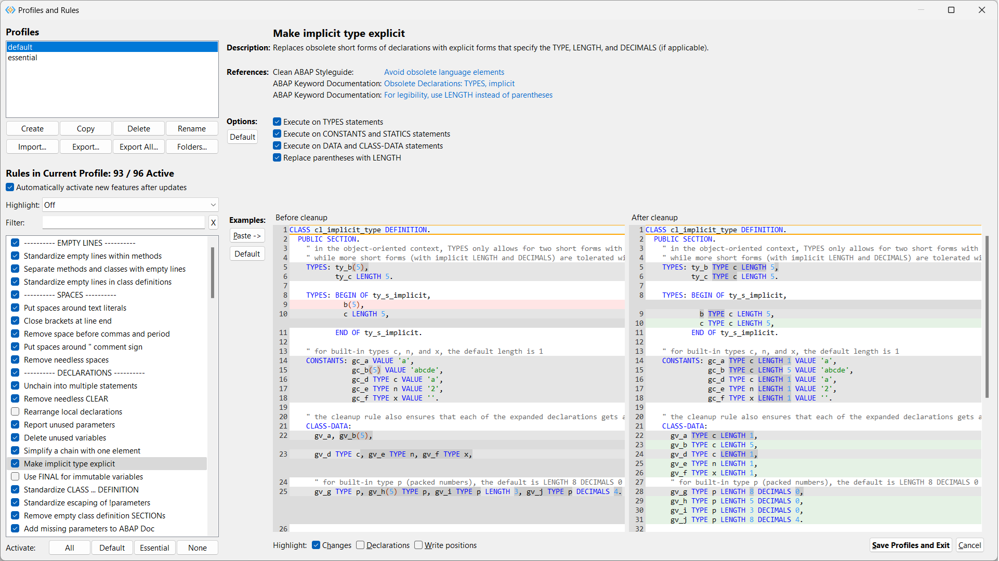

# Profiles and Rules

You may both use this window to learn about the rules implemented in ABAP cleaner, 
and to select and configure these rules in various profiles. 

To show this window, click the 'Configure...' button 
in the 'Cleanup Settings' section on the [main screen](main-window.md). 
All changes made here (including changes to several profiles) are kept in the memory 
until you either save them by leaving the window with the '**Save Profiles and Exit**' button 
(which also triggers a reprocessing of the current code in the main window), 
or discard them all by leaving the window with the '**Cancel**' button. 




## Profiles

Each profile contains all [cleanup rules](rules.md), each rule being either activated or deactivated in the profile. 
Some of the rules allow further configuration; these options and settings are also profile specific. 


Profiles and other ABAP cleaner settings are stored locally on your computer. 
You may create any number of different profiles by using the 
'**Create**' button to create a new profile with default settings, 
or the '**Copy**' button to copy the settings of an existing profile into a new profile. 
All profiles can be deleted (except the last remaining one). 

For instance, you may want to configure a standard profile in which all rules are activated that you agree to use, 
and several special profiles for specific cleanup tasks, in which only one or very few rules are activated. 

### Sharing and synchronizing profiles with colleagues

To **quickly pass on profiles** to colleagues, you may use the '**Export...**' or '**Export All...**' buttons 
and send the exported .cfj file(s) to your colleagues, who could then '**Import...**' them. 
Direct access to the local profiles folder is possible from the [main screen](main-window.md) 
with the menu 'Help / Open Profiles Folder'.

If your team wants to share and **continually synchronize profiles**, 
* your team architect or lead developer may configure a profile as needed 
  and use the '**Export...**' button to store it on a synchronized folder (e.g. on OneDrive). 
* Team members can then use the  '**Folders...**' button to add this synchronized folder 
  as an additional read-only source of **Team Profiles**: 

  

  Team profiles then appear as 'team A: default' etc. in the profile list and can be selected and used, but not modified.

* After changing the configuration of a profile, the team architect or lead developer can simply export it again, 
  overwriting it in the synchronized folder and thus updating it for everyone.


### Profile settings


In the section 'Rules in Current Profile', you can select whether to '**Automatically activate new features after updates**': 
This option determines how the current profile is changed if an ABAP cleaner update contains either a new cleanup 
rule, or adds new configuration to an existing rule:

* If this option is **checked**, new cleanup rules will automatically be *activated*, and new configuration options will 
  be set to their *default value*. The cleanup result could therefore be different from before the ABAP cleaner update.
* If the option is **NOT checked**, new rules will automatically be *deactivated*, and new configuration options will 
  be set to a *neutral value*. The cleanup result is therefore the same as before the ABAP cleaner update, 
  until you decide to activate the new features in this profile yourself (e.g. if your team wants to align on new 
  features first before activating them).

### Highlighting new features or differences between profiles

To easily identify new cleanup rules and configuration, you may choose to '**Highlight: Features added after**' 
a specific earlier ABAP cleaner version. In the rules list, newly added rules will then be marked in green color, 
and rules with added configuration in yellow color. Added configuration options as well as added buttons on the 
profiles editor UI will also be highlighted in green. 


To quickly see how the currently selected profile differs from the default configuration of ABAP cleaner, 
you may select '**Highlight: Differences to ABAP cleaner defaults**'. To compare the current profile with another 
profile from your list, select '**Highlight: Differences to profile '...'**'. In both cases, the colored background 
of cleanup rules and configuration options will point out the differences. 

### Filter rules by name

The '**Filter**' text field above the rules list allows to filter the rule list by rule name (non-case-sensitive).
Click on the '**X**' button to reset the filter and display all available rules.
 

## Rules

The '**Rules in Current Profile**' list shows which rules are activated in the currently selected profile. 


The rules are grouped into several sections 
('EMPTY LINES, SPACES, DECLARATIONS, SYNTAX, COMMANDS, PRETTY PRINTER, ALIGNMENT'); 
you may (de)activate the section headers to (de)activate all rules in this section, 
or use the buttons '**Activate: All / Default / Essential / None**' below the list. 
Here, '**Default**' will activate all rules that are active by ABAP cleaner defaults (which is true for 
most rules), while '**Essential**' will only activate rules that are explicitly demanded by the 
[Clean ABAP Styleguide](https://github.com/SAP/styleguides/blob/main/clean-abap/CleanABAP.md).

Click on one rule in the list to see a **Description**, **References**, **Options**, 
and **Examples** for this rule on the right-hand side of the window. 
If needed, you may use _Ctrl+C_ to copy the name of the current rule from the rule list to the clipboard. 
Alternatively, you may right-click the rule name or description on the right-hand side. 

### References

The references show which documents the rule is based on. 


You may click on the links on the screen to open the specific website:

- the [Clean ABAP Styleguide](https://github.com/SAP/styleguides/blob/main/clean-abap/CleanABAP.md);
- the [Clean Code Checks](https://github.com/SAP/code-pal-for-abap/blob/master/docs/check_documentation.md), as implemented in the [code pal for ABAP](https://github.com/SAP/code-pal-for-abap) tool;
- the [ABAP Keyword Documentation](https://help.sap.com/doc/abapdocu_latest_index_htm/latest/en-US/index.htm), esp. its [Programming Guidelines](https://help.sap.com/doc/abapdocu_latest_index_htm/latest/en-US/index.htm?file=abenabap_pgl.htm) and sections on [Obsolete Language Elements](https://help.sap.com/doc/abapdocu_latest_index_htm/latest/en-US/index.htm?file=abenabap_obsolete.htm).

In some cases, a contradiction of the rule to a guideline may be shown, e.g. with '<-> Clean ABAP Styleguide'. 

### Options and Defaults

Options (if any) allow to configure the current rule. The effects are immediately shown in the example code. 
Click the 'Options: **Default**' button to revert the configuration of the current rule to the ABAP cleaner defaults. 


If you unchecked the option 'Automatically activate new features after updates' (see above) for the current profile, 
options that were added with a later update to an existing rule will at first be set to a 'neutral value' 
(so these new options will have NO effect on the cleanup result). If you want to activate these new options, 
you may again use the '**Default**' button to set them to the ABAP cleaner default (which usually differs from the 'neutral value').

#### Alignment between ABAP cleaner, Clean ABAP style guide, and code pal for ABAP

Since all the projects mentioned above have overlapping concerns, we strive to keep the default configuration of 
ABAP cleaner aligned with the guidance given in those projects. This means that default settings in ABAP cleaner 
may evolve over time, along with changes to the Clean ABAP style guide, new Clean Code Checks, the discussion between 
the involved teams and communities etc. 

Note, however, that ABAP cleaner defaults are only used when creating a _new_ profile (or when you use the 'Default' 
button described above). By contrast, an already existing profile will not be affected by later changes to the 
ABAP cleaner defaults. 

More information on how the Clean ABAP style guide, code pal for ABAP, and ABAP cleaner relate to each other 
can be found in the blog post on [ABAP Tools for Clean ABAP](https://blogs.sap.com/2023/10/09/abap-tools-for-clean-abap/).


### Examples

The examples demonstrate how a rule (and its configuration with options and settings) works. 
You may deactivate the '**Highlight: Changes**' option below the code 
to appreciate the final look of the code (without background color highlighting) 
before and after the rule is applied (left -&gt; right code display). 


The option '**Highlight: Declarations**' displays declaration keywords such as ```DATA``` or ```FIELD-SYMBOLS``` in 
a different color. If you activate the option '**Highlight: Write positions**', variables in write positions will be 
highlighted in a different color, which may be helpful for looking at rules such as 'Use FINAL for immutable variables' 
and 'Delete unused variables'.

If you would like to test the effect of the current cleanup rule and its configuration on your own code, you can copy 
a code section into the clipboard and click the '**Paste -\>**' button. You can then change the configuration options 
of the rule (if any) to see how different settings will look on your code. Please make sure that all blocks in the pasted 
code are closed (i.e. there must not be an `IF` without the corresponding `ENDIF` etc.). Click the 'Examples: **Default**' 
button to see the built-in example code again (this is done automatically if you move to a different rule). 
Note that some rules require context information (e.g. whole `METHOD ... ENDMETHOD` blocks) and will therefore 
keep snippets unchanged if the required context is missing.

**Continue reading**: [Release notes](release-notes.md)
