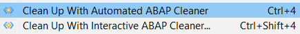
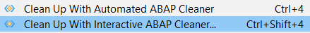
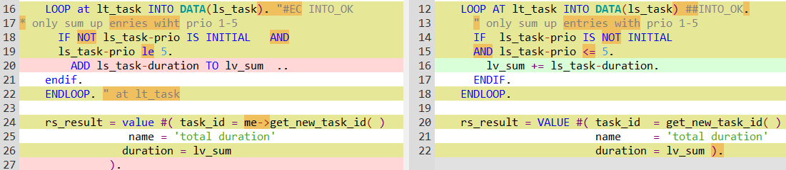
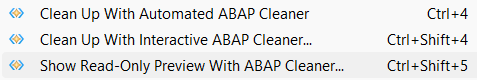
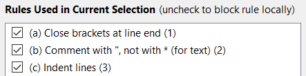

# How to use ABAP cleaner

## Cleaning code from ADT with the ABAP cleaner plug-in 

### Automated cleanup 

To clean ABAP code **automatically** with a single keystroke, 

1. **Select** any amount of **ABAP code** in the current code editor in ADT - 
   or alternatively, do NOT select any code to apply cleanup to the current method or declaration section. 
2. **Press *Ctrl + 4*** or select menu 'Source Code / Clean Up With **Automated** ABAP Cleaner'. 
   The cleanup will be done automatically, using the profile and cleanup range that was last selected 
   when you used the interactive ABAP cleaner UI (see below). 

   

If you clean a selection of code, ABAP cleaner will expand your selection to whole ABAP statements. 
With the plug-in, you are not required to select complete code blocks 
(e.g., you may select an ```IF``` without its corresponding ```ENDIF```). 

### Interactive cleanup 

To clean ABAP code **interactively**, 

1. **Select** any amount of **ABAP code** in the current code editor in ADT - 
   or alternatively, do NOT select any code to apply cleanup to the current method or declaration section. 
2. **Press *Ctrl + Shift + 4*** or select menu 'Source Code / Clean Up With **Interactive** ABAP Cleaner...'. 
   This will open the ABAP cleaner UI to compare the original and the cleaned code. 

   

3. **Check** the changes highlighted in the display, using 
   the arrow keys _Left / Right_ to navigate to the previous / next finding 
   (or _Ctrl + Left / Right_ for the previous / next screen with findings). 

   

   (Un)check the 'Highlight ...' options to focus on certain types of changes. 
   If you come across a changed statement which you prefer to keep in its original state, 
   simply deactivate the applied rule(s) in the 'Rules Used in Current Selection' list 
   for this statement. You may also configure or select a different [profile](profiles.md) for the cleanup. 
4. **Press *Ctrl + Enter*** or click 'Apply and Close' to apply the result and return to the ADT editor; 
   to discard the changes, press **Esc** or click 'Cancel'. 

### Read-only preview without locking or changing code 

If you only want a **preview** of the cleaned code, **without locking or changing** the code 
(e.g. because the object is locked by another person, or you do not have development authorization in the current system), 

1. **Select** any amount of **ABAP code** in the current code editor in ADT.
2. **Press *Ctrl + Shift + 5*** or select menu 'Source Code / Show **Read-Only Preview** With ABAP Cleaner...': 

   

This opens the interactive ABAP cleaner UI as described above, but the code will not be locked or changed. 
Nevertheless, changes to ABAP cleaner settings (selected profile, activated rules and options etc.) will be kept. 

The read-only preview also allows you to **paste other ABAP code** (e.g. from SAP GUI) into the ABAP cleaner UI 
by pressing ***Ctrl + V*** or selecting menu 'Code / From Clipboard', or to **read code from a file** with 'Code / From File...'. 


## Cleaning code with the stand-alone ABAP cleaner app

To clean ABAP code,

1. **Enter edit mode** in your development environment (SAP GUI) to block others from changing the code in the meantime.
2. **Copy a section of code** from the IDE to the clipboard. 
   This may be anything from a single statement to an entire code document with several classes. 
   However, any blocks (```IF``` ... ```ENDIF```, ```LOOP``` ... ```ENDLOOP```, ```METHOD``` ... ```ENDMETHOD``` etc.) 
   must be complete for the stand-alone ABAP cleaner app to work. 
3. **Paste** the code into the ABAP cleaner main window by pressing _Ctrl + V_
   or using the menu 'Code / From Clipboard'.
   ABAP cleaner immediately processes the code with the selected Profile; 
   you may select a different profile to reprocess the code with a different selection or configuration of rules.
4. **Check** the changes highlighted in the display, using 
   the arrow keys _Left / Right_ to navigate to the previous / next finding 
   (or _Ctrl + Left / Right_ for the previous / next screen with findings). 
   (Un)check the 'Highlight ...' options to focus on certain types of changes. 
   If you come across a changed statement which you prefer to keep in its original state, 
   simply deactivate the applied rule(s) in the 'Rules Used in Current Selection' list 
   for this statement. 

   

5. **Copy all cleaned code** from ABAP cleaner to the clipboard 
   by pressing _Ctrl + A_ (to select the entire code) and then _Ctrl + C_, 
   or by using the menu 'Code / Whole Result to Clipboard'.
6. **Paste** the code back to your IDE, replacing the previous section of code. 
   It is recommended to keep the code selected in the IDE in step 2, 
   so you are sure to replace the exact section which you copied earlier.

If you activate the ABAP cleaner menu 'Code / **Watch and Modify Clipboard**', you can skip steps 3-5: 
As soon as you copy code into the clipboard, ABAP cleaner will replace the clipboard content with cleaned code
(confirming the action with a sound), so you can immediately replace the selected code by pasting the modified 
clipboard content into your IDE. 


## Calling ABAP cleaner from the command line

To integrate ABAP cleaner in other processes, you may call the "abap-cleaner**c**.exe" of the stand-alone version 
from the command line with the following arguments for cleaning either a single file or multiple files in a directory:

```
Shop help or version information:
    .\abap-cleanerc.exe /?
    .\abap-cleanerc.exe /man
    .\abap-cleanerc.exe --version

Cleanup of single file:
    .\abap-cleanerc.exe {--sourcefile sourcefile / --source sourcecode } [--linerange linerange]
                        [{ --profile profile / --profiledata profiledata }] [--release release]
                        [--crlf] [--targetfile targetfile [--overwrite]] [--partialresult]
                        [--stats] [--usedrules]

Example for cleanup of single file:
    .\abap-cleanerc.exe --sourcefile "CL_ANY_CLASS.txt" --linerange "20-35" --profile "team profile.cfj" --release "757" --targetfile "result\CL_ANY_CLASS.txt" --overwrite --stats --usedrules

Cleanup of multiple files:
    .\abap-cleanerc.exe --sourcedir sourcedir [--filepattern filepattern] [--recursive]
                        [{ --profile profile / --profiledata profiledata }] [--release release]
                        [--targetdir targetdir [--overwrite]]
                        [--stats] [--usedrules]

Example for cleanup of multiple files:
    .\abap-cleanerc.exe --sourcedir "C:\temp\source" --filepattern "*.txt" --recursive --profile "team profile.cfj" --release "757" --targetdir "C:\temp\target" --overwrite

Options for cleanup:
    --sourcefile        File name of an ABAP source file which is input to the cleanup.
    --source            ABAP source code which is input to the cleanup.
                        Please use either --sourcefile or --source or --sourcedir.
    --linerange         Single line range for partial cleanup, e.g. "20-35"
                        Without this option, the cleanup will be applied to the whole code document.

    --sourcedir         Folder that contains ABAP source files (default file pattern is "*.abap")
    --filepattern       File pattern to look for (only relevant when --sourcedir has been supplied)
    --recursive         Searches provided source directory recursively for ABAP files

    --profile           File name of the cleanup profile to be used (extension .cfj).
                        From the UI, you may use button 'Export...' from the profiles editor to create the file.
    --profiledata       Content of the cleanup profile to be used.
                        Please use either --profile or --profiledata (or none for program defaults).
    --release           ABAP release to restrict syntax of cleanup changes, e.g. "758"
                        Without this option, the latest ABAP syntax will be allowed.

    --targetfile        Target file name to which the cleanup result will be saved.
                        Without this option, the cleanup result will be written to the standard output.
    --targetdir         Target directory name to which the cleanup files will be saved
                        If not supplied, --sourcedir will be the target diretory
    --overwrite         Overwrite target file if it already exists.
                        Without this option, an error will be raised if the target file already exists.
    --partialresult     Restrict output to the cleanup result of the --linerange (if supplied).
                        Without this option, the cleanup result of whole code document will be returned.
    --crlf              Use CRLF = "\r\n" as line separator (default: LF = "\n").
    --simulate          Run cleanup without writing the result code to a file or to standard output.
                        Use this option to check the potential effect of cleanup with --stats or --usedrules.

    --stats             Write statistical summary to standard output.
    --usedrules         Write list of used rules to standard output.
```

### GitHub Actions workflow usage 

Here is an example of how the command line options could be used in a GitHub Actions workflow 
[/.github/workflows/clean-up.yml](https://github.com/stockbal/abap-cleanup-test/blob/main/.github/workflows/clean-up.yml) 
that is triggered whenever someone pushes a change to the main branch of the GitHub repository, and then 
1. automatically downloads the latest version of ABAP cleaner, 
2. runs ABAP cleaner on all \*.abap files inside the \/src folder and all its subfolders, 
   using the ABAP cleaner profile ```cleaner-profile.cfj``` and restricting cleanup to the ABAP syntax of release 7.50, 
3. commits the changes:

```yaml
name: Clean Up ABAP Files

on:
  push:
   branches: ["main"]
  # pull_request:
  #   branches: ["main"]

  workflow_dispatch:

jobs:
  Code-Cleanup:
    runs-on: ubuntu-latest

    steps:
      - run: git config --global core.autocrlf true

      - name: Checkout
        uses: actions/checkout@v3

      - name: Download ABAP Cleaner (latest version)
        run: |
          mkdir .cleanup
          cd .cleanup
          wget -q -c https://github.com/SAP/abap-cleaner/releases/latest/download/com.sap.adt.abapcleaner.app-linux.gtk.x86_64.tar.gz -O - | tar -xz
          cd ..

      - name: Clean-up files in /src
        run: ./.cleanup/abapcleaner/abap-cleaner --sourcedir src --recursive --overwrite --profile cleaner-profile.cfj --release 750 --stats --usedrules

      - name: Commit changes
        uses: EndBug/add-and-commit@v9
        with:
          default_author: github_actions
          message: "style: code cleanup with ABAP cleaner"
          add: "src"
```

**Continue reading**: [Main window](main-window.md)
