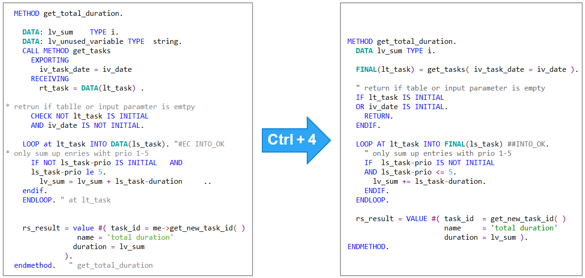
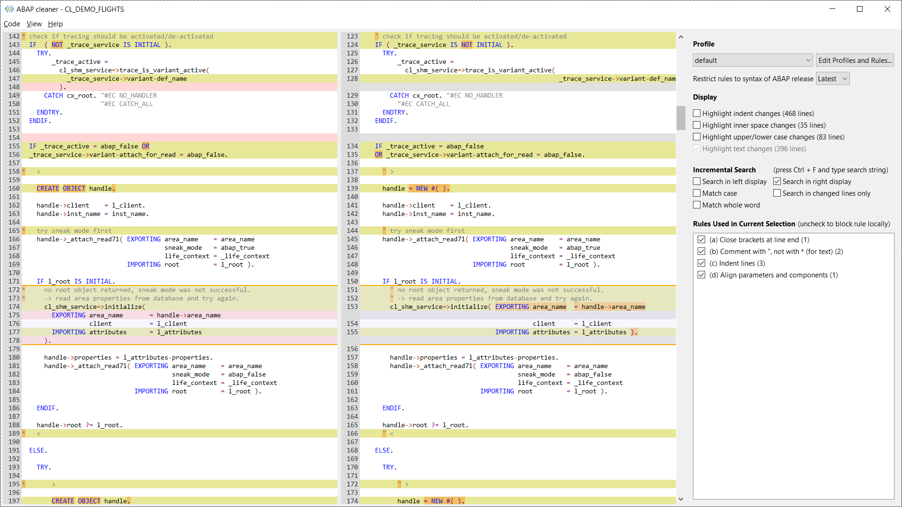
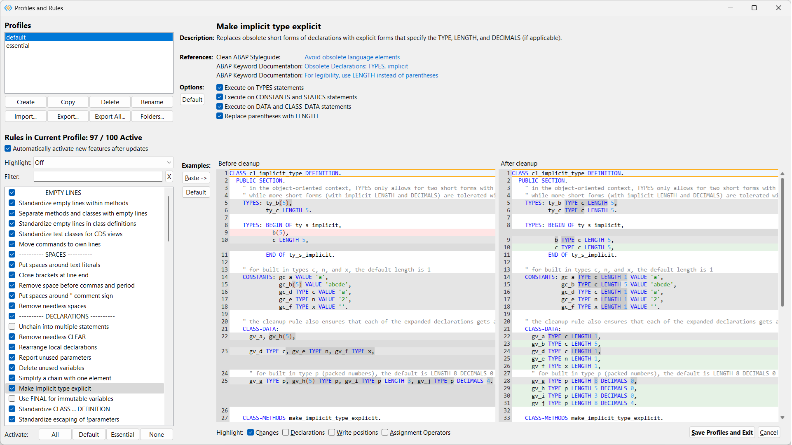

# ABAP Cleaner

ABAP cleaner applies 100+ cleanup rules to ABAP code at a single keystroke.

## Features

- **Format selection** of ABAP code or CDS view - anything from a single statement to an entire code document
- **Interactive cleanup** on the ABAP cleaner UI (diff view) with local (de)activation of cleanup rules
- **100+ cleanup rules** for alignment, declarations, spaces, replacing obsolete commands, syntax improvements, frequent typos etc.
- **Configuration** settings to fine-tune the behavior of all cleanup rules
- **Code examples** immediately show the effect of all configuration settings
- **Multiple cleanup profiles** for specific cleanup tasks or contexts (workspaces)
- **Team profiles** can be synchronized via OneDrive etc. for common code style
- **Restriction of ABAP syntax** to a given ABAP release

### Interactive cleanup UI

### Configuration of profiles and rules

## Installation

### From the VS Code Marketplace

On the [ABAP cleaner](https://marketplace.visualstudio.com/items?itemName=SAPOSS.abap-cleaner) page, click Install.

### From GitHub releases

1. Download the `.vsix` file for your platform from the latest [release assets](https://github.com/SAP/abap-cleaner/releases), 
   e.g. for Windows, `abapcleaner-vscode-win32.win32.x86_64.vsix`.

2. In the VS Code Command Palette, enter 'Extensions: Install from VSIX...' and select the downloaded .vsix file
   to install the ABAP cleaner extension.

### Requirements

**Java 21** or higher (e.g. [SapMachine](https://sapmachine.io/) or [Adoptium Temurin](https://adoptium.net/)) 
must be installed, and in the app 'Edit the system environment variables' (Windows), System environment variable '**PATH**' 
must contain the path to the java.exe (e.g. C:\Program Files\SapMachine\JDK\21\bin).

## Usage

Open an editor with ABAP code (.abap file) or a CDS view (.acds file) and select one of the following 'ABAP Cleaner: ...' commands, 
or press the corresponding shortcut: 

- **Format Selection** (Ctrl+4 / ⌘4) — formats only the selected lines, or the current method if no code was selected
- **Format Document** (Ctrl+5 / ⌘5) — formats the entire code document, also used for setting 'Editor: Format on Save'
- **Format Interactively** (Ctrl+Shift+4 / ⌘⇧4) — opens the ABAP cleaner UI for interactive cleanup
- **Show Read-Only Preview** (Ctrl+Shift+5 / ⌘⇧5) — shows the cleanup result without applying it

## Documentation, Demos, Release Notes, Support

Please visit the [ABAP cleaner](https://github.com/SAP/abap-cleaner) repository for 

- detailed documentation,
- [demos](https://github.com/SAP/abap-cleaner#demo-of-abap-cleaner),
- [available cleanup rules](https://github.com/SAP/abap-cleaner/blob/main/docs/rules.md), 
- [release notes](https://github.com/SAP/abap-cleaner/blob/main/docs/release-notes.md), 
- opening [issues](https://github.com/SAP/abap-cleaner/issues?q=is%3Aissue%20state%3Aopen) etc. 

